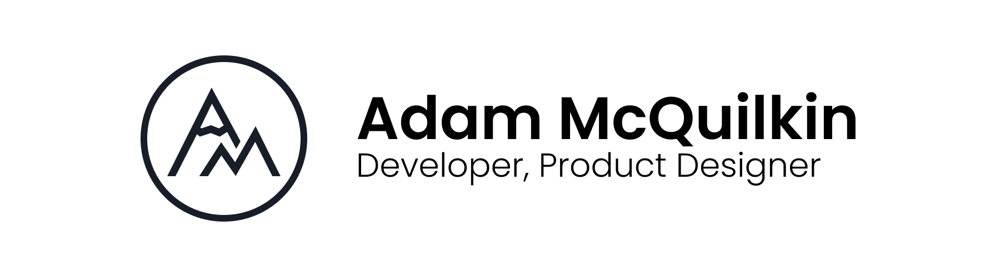

# Adam McQuilkin — @ajmcquilkin

## :wave: About Me

Hello! My name is Adam and I'm an open-source developer. I'm currently working with the @meshtastic project to build reliable, long-range, and affordable mesh networks. I studied CS and Engineering at Dartmouth College, and I'm currently working in the small business tech world. I'm very experienced in Rust, TypeScript, and React, and I have background in embedded systems and C/C++.

## :sparkles: What I'm Working On

I joined the Meshtastic project in 2022 with the goal of simplifying the process of deploying and managing large-scale ad-hoc mesh networks. Meshtastic maintains clients that allow for management of singular mesh radios, but not for managing large-scale networks.

As part of this goal, I am building the [Meshtastic Network Management Client](https://github.com/ajmcquilkin/meshtastic-network-management-client), a desktop application that allows users to create, configure, and manage large-scale Meshtastic networks. Additionally, I'm building the [Meshtastic Network Simulator](https://github.com/ajmcquilkin/meshtastic-network-simulator), a desktop application that allows users to simulate large-scale Meshtastic networks. This simulator is used both to test the network management client and to test the Meshtastic firmware.

I also maintain the official [Meshtastic Rust library](https://github.com/meshtastic/rust), which allows developers to easily interface with Meshtastic radios in a type-safe way from Rust. This library is used by both the network management client and the network simulator.

## :chart_with_upwards_trend: My Stats

## :muscle: What I'm Proficient With

<!--  -->
<!--  -->

<!--  -->
<!--  -->
<!--  -->
<!--  -->

<!--  -->
<!--  -->
<!--  -->

<!--  -->
<!--  -->

<!--  -->
<!--  -->

<!-- 

 -->

## :memo: What I've Worked With

<!--  -->
<!--  -->

<!-- ## :book: What I'm Learning -->

<!--  -->

## :computer: My Setup

In case you're curious!

(btw)

<!--  :heart: -->
